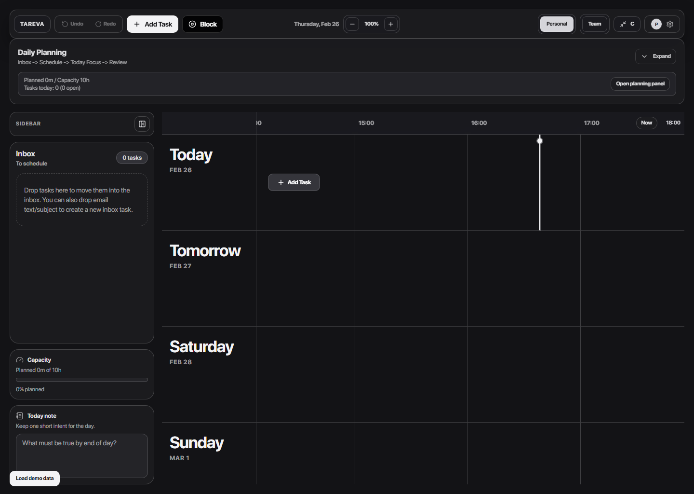
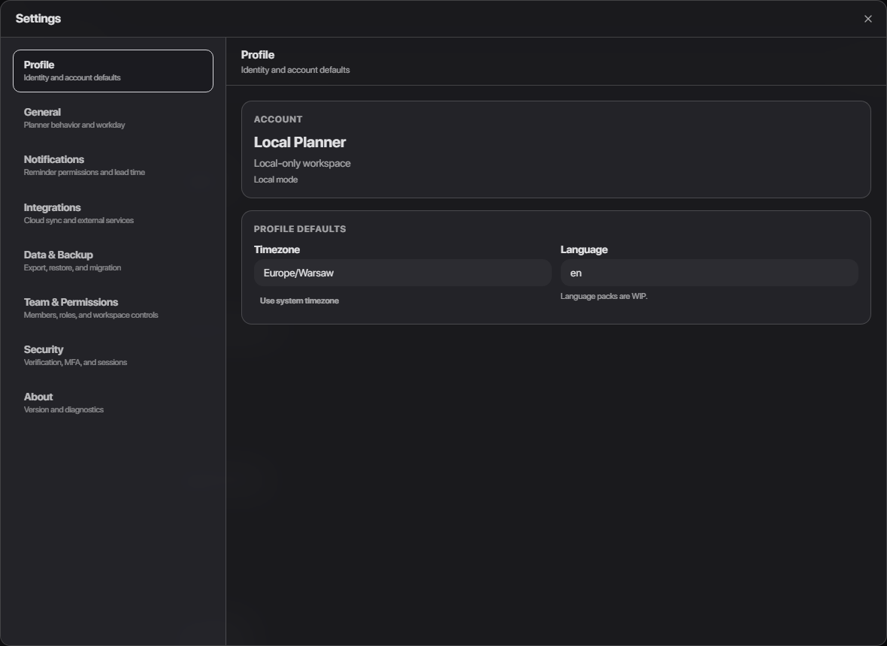
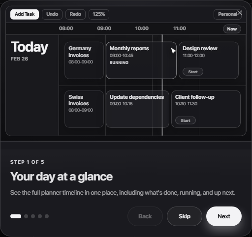
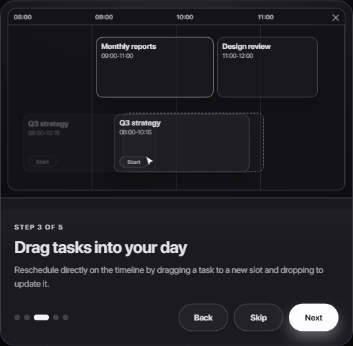
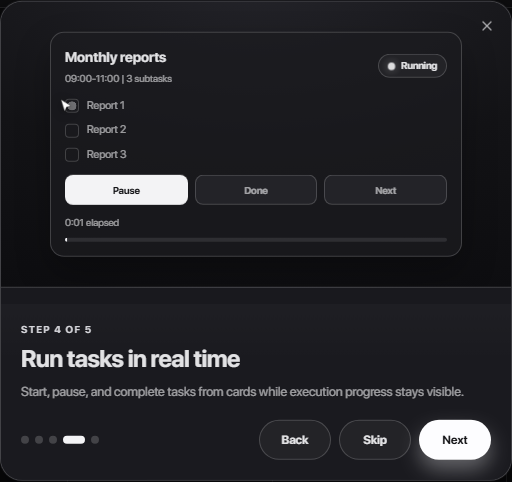

# Taskable Master Style Guide

This file is the visual and implementation source of truth for UI work.
If a change conflicts with this guide, this guide wins.

## Visual Reference Frames

### Planner + HUD layout

### Task box style

### Settings drawer style

### Onboarding parity references

## Source Of Truth Files

- Theme and semantic color tokens: `src/styles/theme.css`
- UI system tokens and primitives: `src/ui-system/styles/tokens.css`, `src/ui-system/styles/components.css`, `src/ui-system/styles/layout.css`
- Planner top rail and HUD controls: `src/app/components/PlannerTopRail.tsx`
- Timeline day grid behavior and drop logic: `src/app/components/DayColumn.tsx`
- Task card visuals and interaction states: `src/app/components/TaskCard.tsx`
- Settings shell/navigation/sections: `src/app/components/settings/SettingsDrawer.tsx`, `src/app/components/settings/SettingsNav.tsx`, `src/app/components/settings/sections/*`
- Onboarding modal and scene previews: `src/app/components/onboarding/OnboardingTutorialModal.tsx`, `src/app/components/onboarding/OnboardingTutorialModal.css`

## Non-Negotiable Visual Rules

1. Use semantic tokens only (`--hud-*`, `--board-*`, `--timeline-*`, `--ui-v1-*`), not random hex values in component code.
2. Keep HUD treatment consistent: subtle blur + layered dark surfaces + thin borders + high-contrast text.
3. Preserve rounded geometry:
   - micro controls: `8px-10px`
   - surfaces/cards: `12px-18px`
   - CTA pills: full pill radius (`999px`) where currently used.
4. Use existing button hierarchy:
   - neutral/secondary actions use HUD surface buttons
   - primary actions use `--hud-accent-bg` + `--hud-accent-text`
5. Timeline must keep:
   - hour grid lines
   - now line
   - day label column hierarchy
   - task cards anchored to grid and time semantics.

## Calendar + Task Box Contract

- Task cards are not generic cards; they are timeline objects with execution state.
- Staggering is a global rule across all calendar surfaces (planner, compact, onboarding demo, welcome preview): cards alternate vertical offset by time band, regardless of task state.
- Do not shrink cards to fake stagger; preserve card size and move cards lower with row-height budget so corners never clip.
- Execution controls (`Start/Pause/Done`) and subtasks must visually match existing task card language.
- Drag/drop motion must read as real object movement (origin -> drag path -> destination update), never as spawning/fading from nowhere.
- If onboarding demonstrates a calendar interaction, it must mirror live planner behavior and shape language.
- Welcome preview cards must use the same dark token palette and stagger language as planner cards; avoid random neon or ad-hoc color systems.

## Inbox Contract

- Inbox queue is single-source in the sidebar Inbox panel.
- Daily Planning panel must not render a second inbox queue card/list.
- Planner copy can reference Inbox, but queue content lives in one surface only.

## Settings Contract

- Settings is a high-density HUD drawer, not a separate design system.
- Left nav uses same HUD borders, muted labels, and active-state treatment as planner controls.
- Section surfaces and form controls must stay inside HUD token palette.

## Onboarding Contract

- Footer actions are one row: dots on left, actions on right (`Back`, `Skip`, `Next/Finish`).
- Step 3 shows real in-calendar rescheduling by drag.
- Step 4 shows a real execution sequence:
  - cursor clicks `Start`
  - then checks `Report 1`, `Report 2`, `Report 3`
  - primary action label transitions to `Pause`.

## Implementation Checklist

- Before changing UI, read the source-of-truth files listed above.
- Reuse existing classes/tokens first; create new styling only when no current primitive fits.
- Validate in both desktop and mobile breakpoints.
- For onboarding or visual demos, ensure animations pause when scene is hidden and restart on scene entry.
